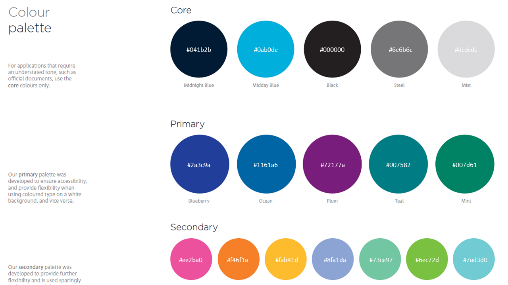

<!-- README.md is generated from README.Rmd. Please edit that file -->

```{r, include = FALSE}
knitr::opts_chunk$set(
  collapse = TRUE,
  comment = "#>",
  fig.path = "figures/README-",
  fig.dpi = 300
)
```

# ggbluebadge 

<!-- badges: start -->
<!-- badges: end -->

The goal of ggbluebadge is to faciliate the use of the visual identity of the [CSIRO](www.csiro.au) for R programmers.

## Installation

ggbluebadge lives on GitHub for now, so you need to use [devtools](https://cran.r-project.org/web/packages/devtools/index.html) (or similar) to install it:

``` r
# install devtoos if you don't have it
install.packages("devtools")

devtools::install_github("waldnerf/ggbluebadge)
```

## Color Palette


### The Visual Identity
The colour palette used in ggbluebadge matches the new visual identity of the CSIRO.





### Overview of the colour palettes


From this list, I chose just a few that I thought worked well together for colour and fill scales: main,  greys, primary, secondary, and data61.


``` {r main, fig.height = 3, fig.width = 3}
ggbluebadge::show_my_palette("main")
```


``` {r greys, fig.height = 3, fig.width = 3}
ggbluebadge::show_my_palette("greys")
```

``` {r primary, fig.height = 3, fig.width = 3}
ggbluebadge::show_my_palette("primary")
```

``` {r secondary, fig.height = 3, fig.width = 3}
ggbluebadge::show_my_palette("secondary")
```

``` {r data61, fig.height = 3, fig.width = 3}
ggbluebadge::show_my_palette("data61")
```


## Setup theme and scales
There are four variants of the theme-generating function theme_ggbluebadge():


1. theme_csiro() sets the plot theme to be representative of the paper and styling of the watercolors and includes a paper-colored background,

2. theme_csiro_dark() has the same styling, just with a transparent (or white) background,

3. theme_data61() has the paper-colored background and defaults to a fancy handwritten font (Homemade Apple).

4. theme_data61_dark() has the paper-colored background and defaults to a fancy handwritten font (Homemade Apple).


