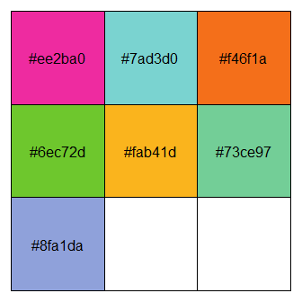

<!-- README.md is generated from README.Rmd. Please edit that file -->
ggbluebadge 
========================================================================

<!-- badges: start -->
<!-- badges: end -->
The goal of ggbluebadge is to faciliate the use of the visual identity
of the [CSIRO](www.csiro.au) for R programmers.

Installation
------------

ggbluebadge lives on GitHub for now, so you need to use
[devtools](https://cran.r-project.org/web/packages/devtools/index.html)
(or similar) to install it:

``` r
# install devtoos if you don't have it
install.packages("devtools")

devtools::install_github("waldnerf/ggbluebadge)
```

Color Palette
-------------

### The Visual Identity

The colour palette used in ggbluebadge matches the new visual identity
of the CSIRO.


### Overview of the colour palettes

From this list, I chose just a few that I thought worked well together
for colour and fill scales: main, greys, primary, secondary, and data61.

``` r
ggbluebadge::show_my_palette("main")
```


``` r
ggbluebadge::show_my_palette("greys")
```


``` r
ggbluebadge::show_my_palette("primary")
```


``` r
ggbluebadge::show_my_palette("secondary")
```



``` r
ggbluebadge::show_my_palette("data61")
```


Setup theme and scales
----------------------

There are four variants of the theme-generating function
theme\_ggbluebadge():

1.  theme\_csiro() sets the plot theme to be representative of the paper
    and styling of the watercolors and includes a paper-colored
    background,

2.  theme\_csiro\_dark() has the same styling, just with a transparent
    (or white) background,

3.  theme\_data61() has the paper-colored background and defaults to a
    fancy handwritten font (Homemade Apple).

4.  theme\_data61\_dark() has the paper-colored background and defaults
    to a fancy handwritten font (Homemade Apple).
