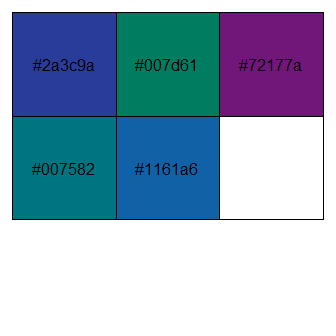

<!-- README.md is generated from README.Rmd. Please edit that file -->
ggbluebadge 
========================================================================

<!-- badges: start -->
<!-- badges: end -->
The goal of ggbluebadge is to help R programmers produce figures that
are consistent with [CSIRO](www.csiro.au)’s visual identity.

Installation
------------

ggbluebadge lives on GitHub for now, so you need to use
[devtools](https://cran.r-project.org/web/packages/devtools/index.html)
(or similar) to install it:

``` r
# install devtoos if you don't have it
install.packages("devtools")

devtools::install_github("waldnerf/ggbluebadge")
library(ggplot2)
library(dplyr)
library(tidyverse)
```

Color Palette
-------------

### The Visual Identity

The colour palette used in ggbluebadge matches the new visual identity
of the CSIRO (the codes within the colours are their hexadecimal codes).


### Overview of the colour palettes

Official colours can be displayed as follows:

``` r
ggbluebadge::show_csiro_colours()
```


From this list, I chose just a few that I thought worked well together
for colour and fill scales: main, greys, primary, secondary, and data61.

``` r
ggbluebadge::show_my_palette("main")
```


``` r
ggbluebadge::show_my_palette("greys")
```


``` r
ggbluebadge::show_my_palette("primary")
```



``` r
ggbluebadge::show_my_palette("secondary")
```


Setup theme and scales
----------------------

There are four variants of the theme-generating function theme\_csiro():

1.  theme\_csiro() sets the plot theme,

2.  theme\_csiro\_dark() has the same styling, just with a midnight blue
    background,

3.  theme\_pub() is sober theme for publications.

Of course, you can mix and match the themes and the colour palettes… or
even create your own (see the vignette for some examples).
