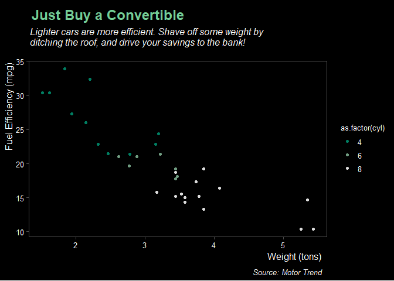
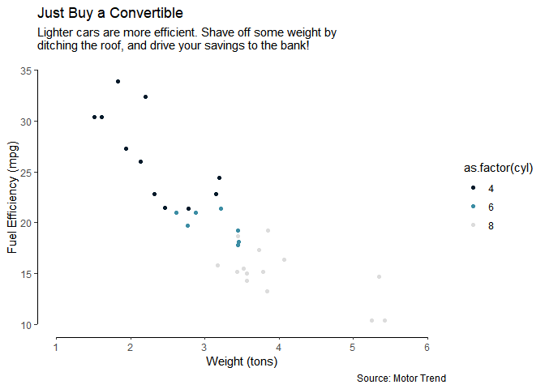
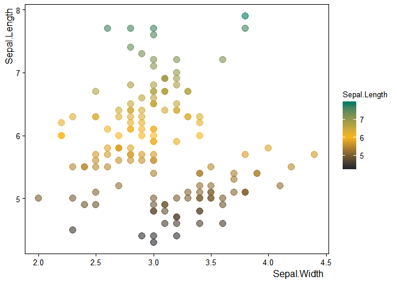
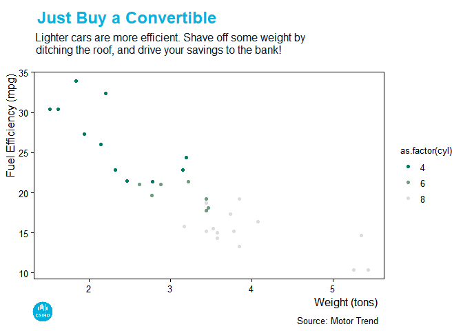

``` r
library(ggplot2)
library(magick)
#> Linking to ImageMagick 6.9.9.14
#> Enabled features: cairo, freetype, fftw, ghostscript, lcms, pango, rsvg, webp
#> Disabled features: fontconfig, x11
library(grid)
library(ggbluebadge)

ggplot(mtcars, aes(wt, mpg, color = as.factor(cyl) )) +
    geom_point() +
    scale_color_csiro(palette="data61") +
    labs(
        x = "Weight (tons)",
        y = "Fuel Efficiency (mpg)",
        title = "Just Buy a Convertible",
        subtitle = "Lighter cars are more efficient. Shave off some weight by\nditching the roof, and drive your savings to the bank!",
        caption = "Source: Motor Trend"
    ) +
    theme_csiro_data61()
#> Warning in grid.Call(C_stringMetric, as.graphicsAnnot(x$label)): font
#> family not found in Windows font database

#> Warning in grid.Call(C_stringMetric, as.graphicsAnnot(x$label)): font
#> family not found in Windows font database
#> Warning in grid.Call(C_textBounds, as.graphicsAnnot(x$label), x$x, x$y, :
#> font family not found in Windows font database
#> Warning in grid.Call(C_stringMetric, as.graphicsAnnot(x$label)): font
#> family not found in Windows font database
#> Warning in grid.Call(C_textBounds, as.graphicsAnnot(x$label), x$x, x$y, :
#> font family not found in Windows font database

#> Warning in grid.Call(C_textBounds, as.graphicsAnnot(x$label), x$x, x$y, :
#> font family not found in Windows font database

#> Warning in grid.Call(C_textBounds, as.graphicsAnnot(x$label), x$x, x$y, :
#> font family not found in Windows font database

#> Warning in grid.Call(C_textBounds, as.graphicsAnnot(x$label), x$x, x$y, :
#> font family not found in Windows font database

#> Warning in grid.Call(C_textBounds, as.graphicsAnnot(x$label), x$x, x$y, :
#> font family not found in Windows font database

#> Warning in grid.Call(C_textBounds, as.graphicsAnnot(x$label), x$x, x$y, :
#> font family not found in Windows font database

#> Warning in grid.Call(C_textBounds, as.graphicsAnnot(x$label), x$x, x$y, :
#> font family not found in Windows font database

#> Warning in grid.Call(C_textBounds, as.graphicsAnnot(x$label), x$x, x$y, :
#> font family not found in Windows font database

#> Warning in grid.Call(C_textBounds, as.graphicsAnnot(x$label), x$x, x$y, :
#> font family not found in Windows font database

#> Warning in grid.Call(C_textBounds, as.graphicsAnnot(x$label), x$x, x$y, :
#> font family not found in Windows font database

#> Warning in grid.Call(C_textBounds, as.graphicsAnnot(x$label), x$x, x$y, :
#> font family not found in Windows font database

#> Warning in grid.Call(C_textBounds, as.graphicsAnnot(x$label), x$x, x$y, :
#> font family not found in Windows font database

#> Warning in grid.Call(C_textBounds, as.graphicsAnnot(x$label), x$x, x$y, :
#> font family not found in Windows font database

#> Warning in grid.Call(C_textBounds, as.graphicsAnnot(x$label), x$x, x$y, :
#> font family not found in Windows font database

#> Warning in grid.Call(C_textBounds, as.graphicsAnnot(x$label), x$x, x$y, :
#> font family not found in Windows font database
#> Warning in grid.Call.graphics(C_text, as.graphicsAnnot(x$label), x$x,
#> x$y, : font family not found in Windows font database
#> Warning in grid.Call(C_textBounds, as.graphicsAnnot(x$label), x$x, x$y, :
#> font family not found in Windows font database

#> Warning in grid.Call(C_textBounds, as.graphicsAnnot(x$label), x$x, x$y, :
#> font family not found in Windows font database

#> Warning in grid.Call(C_textBounds, as.graphicsAnnot(x$label), x$x, x$y, :
#> font family not found in Windows font database

#> Warning in grid.Call(C_textBounds, as.graphicsAnnot(x$label), x$x, x$y, :
#> font family not found in Windows font database
```



``` r


ggplot(mtcars, aes(wt, mpg, color = as.factor(cyl) )) +
    geom_point() +
    scale_color_csiro(palette="main") +
    labs(
        x = "Weight (tons)",
        y = "Fuel Efficiency (mpg)",
        title = "Just Buy a Convertible",
        subtitle = "Lighter cars are more efficient. Shave off some weight by\nditching the roof, and drive your savings to the bank!",
        caption = "Source: Motor Trend"
    ) +
  theme_floating_axes() +
  add_floating_x(range(mtcars$wt)) + 
  add_floating_y(range(mtcars$mpg))
```



``` r


ggplot(iris, aes(Sepal.Width, Sepal.Length, color = Sepal.Length)) +
  geom_point(size = 4, alpha = .6) +
  scale_color_gradient2(low = csiro_cols("midday blue"), mid = csiro_cols("gold"), high = csiro_cols("mint"),midpoint=6) +
  theme_csiro()
#> Warning in grid.Call(C_stringMetric, as.graphicsAnnot(x$label)): font
#> family not found in Windows font database
#> Warning in grid.Call(C_stringMetric, as.graphicsAnnot(x$label)): font
#> family not found in Windows font database
#> Warning in grid.Call(C_textBounds, as.graphicsAnnot(x$label), x$x, x$y, :
#> font family not found in Windows font database

#> Warning in grid.Call(C_textBounds, as.graphicsAnnot(x$label), x$x, x$y, :
#> font family not found in Windows font database

#> Warning in grid.Call(C_textBounds, as.graphicsAnnot(x$label), x$x, x$y, :
#> font family not found in Windows font database

#> Warning in grid.Call(C_textBounds, as.graphicsAnnot(x$label), x$x, x$y, :
#> font family not found in Windows font database

#> Warning in grid.Call(C_textBounds, as.graphicsAnnot(x$label), x$x, x$y, :
#> font family not found in Windows font database

#> Warning in grid.Call(C_textBounds, as.graphicsAnnot(x$label), x$x, x$y, :
#> font family not found in Windows font database

#> Warning in grid.Call(C_textBounds, as.graphicsAnnot(x$label), x$x, x$y, :
#> font family not found in Windows font database

#> Warning in grid.Call(C_textBounds, as.graphicsAnnot(x$label), x$x, x$y, :
#> font family not found in Windows font database
#> Warning in grid.Call.graphics(C_text, as.graphicsAnnot(x$label), x$x,
#> x$y, : font family not found in Windows font database
#> Warning in grid.Call(C_textBounds, as.graphicsAnnot(x$label), x$x, x$y, :
#> font family not found in Windows font database
```



Now, let’s add the CSIRO logo to the figure.

``` r

p <- ggplot(mtcars, aes(wt, mpg, color = as.factor(cyl) )) +
    geom_point() +
    scale_color_csiro(palette="data61") +
    labs(
        x = "Weight (tons)",
        y = "Fuel Efficiency (mpg)",
        title = "Just Buy a Convertible",
        subtitle = "Lighter cars are more efficient. Shave off some weight by\nditching the roof, and drive your savings to the bank!",
        caption = "Source: Motor Trend"
    ) +
    theme_csiro("CorpidOffice")
add_logo(p, logo='csiro')
#> Warning in grid.Call(C_stringMetric, as.graphicsAnnot(x$label)): font
#> family not found in Windows font database

#> Warning in grid.Call(C_stringMetric, as.graphicsAnnot(x$label)): font
#> family not found in Windows font database
#> Warning in grid.Call(C_textBounds, as.graphicsAnnot(x$label), x$x, x$y, :
#> font family not found in Windows font database
#> Warning in grid.Call(C_stringMetric, as.graphicsAnnot(x$label)): font
#> family not found in Windows font database
#> Warning in grid.Call(C_textBounds, as.graphicsAnnot(x$label), x$x, x$y, :
#> font family not found in Windows font database

#> Warning in grid.Call(C_textBounds, as.graphicsAnnot(x$label), x$x, x$y, :
#> font family not found in Windows font database

#> Warning in grid.Call(C_textBounds, as.graphicsAnnot(x$label), x$x, x$y, :
#> font family not found in Windows font database

#> Warning in grid.Call(C_textBounds, as.graphicsAnnot(x$label), x$x, x$y, :
#> font family not found in Windows font database

#> Warning in grid.Call(C_textBounds, as.graphicsAnnot(x$label), x$x, x$y, :
#> font family not found in Windows font database

#> Warning in grid.Call(C_textBounds, as.graphicsAnnot(x$label), x$x, x$y, :
#> font family not found in Windows font database

#> Warning in grid.Call(C_textBounds, as.graphicsAnnot(x$label), x$x, x$y, :
#> font family not found in Windows font database

#> Warning in grid.Call(C_textBounds, as.graphicsAnnot(x$label), x$x, x$y, :
#> font family not found in Windows font database

#> Warning in grid.Call(C_textBounds, as.graphicsAnnot(x$label), x$x, x$y, :
#> font family not found in Windows font database

#> Warning in grid.Call(C_textBounds, as.graphicsAnnot(x$label), x$x, x$y, :
#> font family not found in Windows font database

#> Warning in grid.Call(C_textBounds, as.graphicsAnnot(x$label), x$x, x$y, :
#> font family not found in Windows font database

#> Warning in grid.Call(C_textBounds, as.graphicsAnnot(x$label), x$x, x$y, :
#> font family not found in Windows font database

#> Warning in grid.Call(C_textBounds, as.graphicsAnnot(x$label), x$x, x$y, :
#> font family not found in Windows font database
#> Warning in grid.Call.graphics(C_text, as.graphicsAnnot(x$label), x$x,
#> x$y, : font family not found in Windows font database
#> Warning in grid.Call(C_textBounds, as.graphicsAnnot(x$label), x$x, x$y, :
#> font family not found in Windows font database

#> Warning in grid.Call(C_textBounds, as.graphicsAnnot(x$label), x$x, x$y, :
#> font family not found in Windows font database

#> Warning in grid.Call(C_textBounds, as.graphicsAnnot(x$label), x$x, x$y, :
#> font family not found in Windows font database

#> Warning in grid.Call(C_textBounds, as.graphicsAnnot(x$label), x$x, x$y, :
#> font family not found in Windows font database
```


