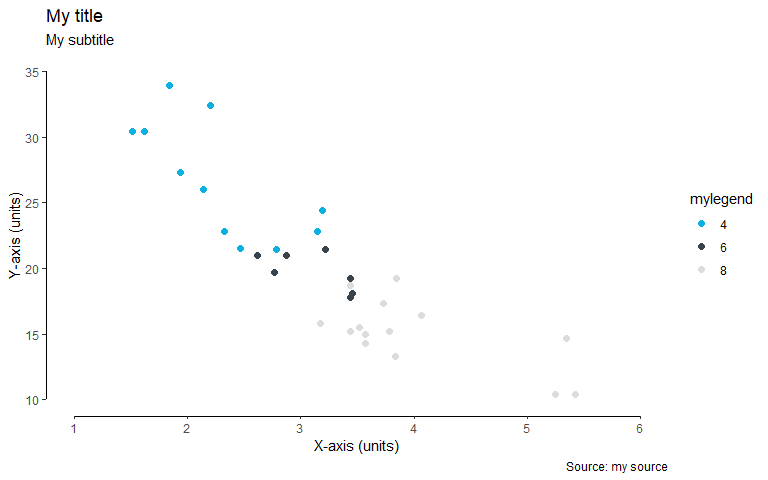

<!-- README.md is generated from README.Rmd. Please edit that file -->
``` r
library(ggplot2)
library(magick)
#> Linking to ImageMagick 6.9.9.14
#> Enabled features: cairo, freetype, fftw, ghostscript, lcms, pango, rsvg, webp
#> Disabled features: fontconfig, x11
library(grid)
library(ggbluebadge)


mtcars$mylegend <- as.factor(mtcars$cyl)
iris$MyLegend <- iris$Sepal.Length

ggplot(mtcars, aes(wt, mpg, color = mylegend )) +
    geom_point(size=2) +
    scale_color_csiro(palette="main") +
    labs(
        x = "X-axis (units)",
        y = "Y-axis (units)",
        title = "My title",
        subtitle = "My subtitle",
        caption = "Source: my source"
    ) +
    theme_csiro()
```


``` r


ggplot(mtcars, aes(wt, mpg, color =mylegend )) +
    geom_point(size=2) +
    scale_color_csiro(palette="main") +
    labs(
        x = "X-axis (units)",
        y = "Y-axis (units)",
        title = "My title",
        subtitle = "My subtitle",
        caption = "Source: my source"
    ) +
    theme_csiro_dark()
```


``` r


ggplot(mtcars, aes(wt, mpg, color =mylegend )) +
    geom_point(size=2) +
    scale_color_manual(values= unname(c(csiro_cols("fuschia"), csiro_cols("gold"), csiro_cols("forest")))) +
    labs(
        x = "X-axis (units)",
        y = "Y-axis (units)",
        title = "My title",
        subtitle = "My subtitle",
        caption = "Source: my source"
    ) +
    theme_csiro_dark()
```


``` r


ggplot(mtcars, aes(wt, mpg, color = mylegend )) +
    geom_point() +
    scale_color_csiro(palette="main") +
    labs(
        x = "X-axis (units)",
        y = "Y-axis (units)",
        title = "My title",
        subtitle = "My subtitle",
        caption = "Source: my source"
    ) +
  theme_floating_axes() +
  add_floating_x(range(mtcars$wt)) + 
  add_floating_y(range(mtcars$mpg))
```



``` r


ggplot(iris, aes(Sepal.Width, Sepal.Length, color = MyLegend)) +
  geom_point(size = 4, alpha = .6) +
  scale_color_gradient2(low = csiro_cols("midday blue"),
                        mid = csiro_cols("gold"),
                        high = csiro_cols("mint"), 
                        midpoint=6) +
  labs(
        x = "X-axis (units)",
        y = "Y-axis (units)",
        title = "My title",
        subtitle = "My subtitle",
        caption = "Source: my source"
    )+
  theme_pub()
```


Now, let’s add the CSIRO logo to the figure.

``` r

p <- ggplot(mtcars, aes(wt, mpg, color = as.factor(cyl) )) +
    geom_point() +
    scale_color_csiro(palette="main") +
    labs(
        x = "X-axis (units)",
        y = "Y-axis (units)",
        title = "My title",
        subtitle = "My subtitle",
        caption = "Source: my source"
    ) +
    theme_csiro()
add_logo(p, logo='csiro')
```


