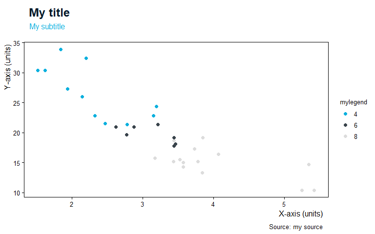
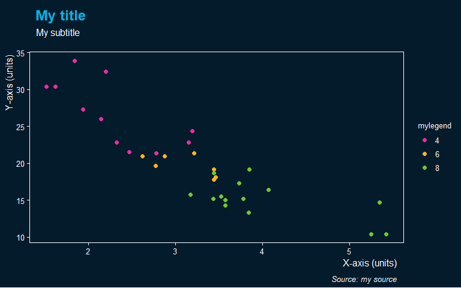

<!-- README.md is generated from README.Rmd. Please edit that file -->
``` r
library(ggplot2)
library(magick)
#> Linking to ImageMagick 6.9.9.14
#> Enabled features: cairo, freetype, fftw, ghostscript, lcms, pango, rsvg, webp
#> Disabled features: fontconfig, x11
library(grid)
library(ggbluebadge)

mtcars$mylegend <- as.factor(mtcars$cyl)
iris$MyLegend <- iris$Sepal.Length

ggplot(mtcars, aes(wt, mpg, color = mylegend )) +
    geom_point() +
    scale_color_csiro(palette="main") +
    labs(
        x = "X-axis (units)",
        y = "Y-axis (units)",
        title = "My title",
        subtitle = "My subtitle",
        caption = "Source: my source"
    ) +
    theme_csiro()
```



``` r


ggplot(mtcars, aes(wt, mpg, color =mylegend )) +
    geom_point() +
    scale_color_csiro(palette="main") +
    labs(
        x = "X-axis (units)",
        y = "Y-axis (units)",
        title = "My title",
        subtitle = "My subtitle",
        caption = "Source: my source"
    ) +
    theme_csiro_dark()
```


``` r


ggplot(mtcars, aes(wt, mpg, color = mylegend )) +
    geom_point() +
    scale_color_csiro(palette="main") +
    labs(
        x = "X-axis (units)",
        y = "Y-axis (units)",
        title = "My title",
        subtitle = "My subtitle",
        caption = "Source: my source"
    ) +
  theme_floating_axes() +
  add_floating_x(range(mtcars$wt)) + 
  add_floating_y(range(mtcars$mpg))
```



``` r


ggplot(iris, aes(Sepal.Width, Sepal.Length, color = MyLegend)) +
  geom_point(size = 4, alpha = .6) +
  scale_color_gradient2(low = csiro_cols("midday blue"),
                        mid = csiro_cols("gold"),
                        high = csiro_cols("mint"),midpoint=6) +
  labs(
        x = "X-axis (units)",
        y = "Y-axis (units)",
        title = "My title",
        subtitle = "My subtitle",
        caption = "Source: my source"
    )
```


``` r
  theme_pub()
#> List of 74
#>  $ line                      :List of 6
#>   ..$ colour       : chr "black"
#>   ..$ size         : num 0.2
#>   ..$ linetype     : chr "solid"
#>   ..$ lineend      : chr "square"
#>   ..$ arrow        : logi FALSE
#>   ..$ inherit.blank: logi FALSE
#>   ..- attr(*, "class")= chr [1:2] "element_line" "element"
#>  $ rect                      :List of 5
#>   ..$ fill         : chr "white"
#>   ..$ colour       : logi NA
#>   ..$ size         : num 0.2
#>   ..$ linetype     : chr "solid"
#>   ..$ inherit.blank: logi FALSE
#>   ..- attr(*, "class")= chr [1:2] "element_rect" "element"
#>  $ text                      :List of 11
#>   ..$ family       : chr "sans"
#>   ..$ face         : chr "plain"
#>   ..$ colour       : chr "black"
#>   ..$ size         : num 12
#>   ..$ hjust        : num 0.5
#>   ..$ vjust        : num 0.5
#>   ..$ angle        : num 0
#>   ..$ lineheight   : num 0.9
#>   ..$ margin       : 'margin' num [1:4] 0pt 0pt 0pt 0pt
#>   .. ..- attr(*, "valid.unit")= int 8
#>   .. ..- attr(*, "unit")= chr "pt"
#>   ..$ debug        : logi FALSE
#>   ..$ inherit.blank: logi FALSE
#>   ..- attr(*, "class")= chr [1:2] "element_text" "element"
#>  $ axis.title.x              :List of 11
#>   ..$ family       : NULL
#>   ..$ face         : NULL
#>   ..$ colour       : NULL
#>   ..$ size         : NULL
#>   ..$ hjust        : NULL
#>   ..$ vjust        : num 1
#>   ..$ angle        : NULL
#>   ..$ lineheight   : NULL
#>   ..$ margin       : 'margin' num [1:4] 3pt 0pt 0pt 0pt
#>   .. ..- attr(*, "valid.unit")= int 8
#>   .. ..- attr(*, "unit")= chr "pt"
#>   ..$ debug        : NULL
#>   ..$ inherit.blank: logi TRUE
#>   ..- attr(*, "class")= chr [1:2] "element_text" "element"
#>  $ axis.title.x.top          :List of 11
#>   ..$ family       : NULL
#>   ..$ face         : NULL
#>   ..$ colour       : NULL
#>   ..$ size         : NULL
#>   ..$ hjust        : NULL
#>   ..$ vjust        : num 0
#>   ..$ angle        : NULL
#>   ..$ lineheight   : NULL
#>   ..$ margin       : 'margin' num [1:4] 0pt 0pt 3pt 0pt
#>   .. ..- attr(*, "valid.unit")= int 8
#>   .. ..- attr(*, "unit")= chr "pt"
#>   ..$ debug        : NULL
#>   ..$ inherit.blank: logi TRUE
#>   ..- attr(*, "class")= chr [1:2] "element_text" "element"
#>  $ axis.title.y              :List of 11
#>   ..$ family       : NULL
#>   ..$ face         : NULL
#>   ..$ colour       : NULL
#>   ..$ size         : NULL
#>   ..$ hjust        : NULL
#>   ..$ vjust        : num 1
#>   ..$ angle        : num 90
#>   ..$ lineheight   : NULL
#>   ..$ margin       : 'margin' num [1:4] 0pt 3pt 0pt 0pt
#>   .. ..- attr(*, "valid.unit")= int 8
#>   .. ..- attr(*, "unit")= chr "pt"
#>   ..$ debug        : NULL
#>   ..$ inherit.blank: logi TRUE
#>   ..- attr(*, "class")= chr [1:2] "element_text" "element"
#>  $ axis.title.y.right        :List of 11
#>   ..$ family       : NULL
#>   ..$ face         : NULL
#>   ..$ colour       : NULL
#>   ..$ size         : NULL
#>   ..$ hjust        : NULL
#>   ..$ vjust        : num 0
#>   ..$ angle        : num -90
#>   ..$ lineheight   : NULL
#>   ..$ margin       : 'margin' num [1:4] 0pt 0pt 0pt 3pt
#>   .. ..- attr(*, "valid.unit")= int 8
#>   .. ..- attr(*, "unit")= chr "pt"
#>   ..$ debug        : NULL
#>   ..$ inherit.blank: logi TRUE
#>   ..- attr(*, "class")= chr [1:2] "element_text" "element"
#>  $ axis.text                 :List of 11
#>   ..$ family       : chr "sans"
#>   ..$ face         : chr "plain"
#>   ..$ colour       : chr "black"
#>   ..$ size         : 'rel' num 0.8
#>   ..$ hjust        : NULL
#>   ..$ vjust        : NULL
#>   ..$ angle        : NULL
#>   ..$ lineheight   : NULL
#>   ..$ margin       : NULL
#>   ..$ debug        : NULL
#>   ..$ inherit.blank: logi FALSE
#>   ..- attr(*, "class")= chr [1:2] "element_text" "element"
#>  $ axis.text.x               :List of 11
#>   ..$ family       : NULL
#>   ..$ face         : NULL
#>   ..$ colour       : NULL
#>   ..$ size         : NULL
#>   ..$ hjust        : NULL
#>   ..$ vjust        : num 1
#>   ..$ angle        : NULL
#>   ..$ lineheight   : NULL
#>   ..$ margin       : 'margin' num [1:4] 2.4pt 0pt 0pt 0pt
#>   .. ..- attr(*, "valid.unit")= int 8
#>   .. ..- attr(*, "unit")= chr "pt"
#>   ..$ debug        : NULL
#>   ..$ inherit.blank: logi TRUE
#>   ..- attr(*, "class")= chr [1:2] "element_text" "element"
#>  $ axis.text.x.top           :List of 11
#>   ..$ family       : NULL
#>   ..$ face         : NULL
#>   ..$ colour       : NULL
#>   ..$ size         : NULL
#>   ..$ hjust        : NULL
#>   ..$ vjust        : num 0
#>   ..$ angle        : NULL
#>   ..$ lineheight   : NULL
#>   ..$ margin       : 'margin' num [1:4] 0pt 0pt 2.4pt 0pt
#>   .. ..- attr(*, "valid.unit")= int 8
#>   .. ..- attr(*, "unit")= chr "pt"
#>   ..$ debug        : NULL
#>   ..$ inherit.blank: logi TRUE
#>   ..- attr(*, "class")= chr [1:2] "element_text" "element"
#>  $ axis.text.y               :List of 11
#>   ..$ family       : NULL
#>   ..$ face         : NULL
#>   ..$ colour       : NULL
#>   ..$ size         : NULL
#>   ..$ hjust        : num 1
#>   ..$ vjust        : NULL
#>   ..$ angle        : NULL
#>   ..$ lineheight   : NULL
#>   ..$ margin       : 'margin' num [1:4] 0pt 2.4pt 0pt 0pt
#>   .. ..- attr(*, "valid.unit")= int 8
#>   .. ..- attr(*, "unit")= chr "pt"
#>   ..$ debug        : NULL
#>   ..$ inherit.blank: logi TRUE
#>   ..- attr(*, "class")= chr [1:2] "element_text" "element"
#>  $ axis.text.y.right         :List of 11
#>   ..$ family       : NULL
#>   ..$ face         : NULL
#>   ..$ colour       : NULL
#>   ..$ size         : NULL
#>   ..$ hjust        : num 0
#>   ..$ vjust        : NULL
#>   ..$ angle        : NULL
#>   ..$ lineheight   : NULL
#>   ..$ margin       : 'margin' num [1:4] 0pt 0pt 0pt 2.4pt
#>   .. ..- attr(*, "valid.unit")= int 8
#>   .. ..- attr(*, "unit")= chr "pt"
#>   ..$ debug        : NULL
#>   ..$ inherit.blank: logi TRUE
#>   ..- attr(*, "class")= chr [1:2] "element_text" "element"
#>  $ axis.ticks                : list()
#>   ..- attr(*, "class")= chr [1:2] "element_blank" "element"
#>  $ axis.ticks.length         : 'unit' num 3pt
#>   ..- attr(*, "valid.unit")= int 8
#>   ..- attr(*, "unit")= chr "pt"
#>  $ axis.ticks.length.x       : NULL
#>  $ axis.ticks.length.x.top   : NULL
#>  $ axis.ticks.length.x.bottom: NULL
#>  $ axis.ticks.length.y       : NULL
#>  $ axis.ticks.length.y.left  : NULL
#>  $ axis.ticks.length.y.right : NULL
#>  $ axis.line                 : list()
#>   ..- attr(*, "class")= chr [1:2] "element_blank" "element"
#>  $ axis.line.x               :List of 6
#>   ..$ colour       : chr "black"
#>   ..$ size         : num 0.6
#>   ..$ linetype     : NULL
#>   ..$ lineend      : chr "square"
#>   ..$ arrow        : logi FALSE
#>   ..$ inherit.blank: logi FALSE
#>   ..- attr(*, "class")= chr [1:2] "element_line" "element"
#>  $ axis.line.y               :List of 6
#>   ..$ colour       : chr "black"
#>   ..$ size         : num 0.6
#>   ..$ linetype     : NULL
#>   ..$ lineend      : chr "square"
#>   ..$ arrow        : logi FALSE
#>   ..$ inherit.blank: logi FALSE
#>   ..- attr(*, "class")= chr [1:2] "element_line" "element"
#>  $ legend.background         : list()
#>   ..- attr(*, "class")= chr [1:2] "element_blank" "element"
#>  $ legend.margin             : 'margin' num [1:4] 6pt 6pt 6pt 6pt
#>   ..- attr(*, "valid.unit")= int 8
#>   ..- attr(*, "unit")= chr "pt"
#>  $ legend.spacing            : 'unit' num 0lines
#>   ..- attr(*, "valid.unit")= int 3
#>   ..- attr(*, "unit")= chr "lines"
#>  $ legend.spacing.x          : NULL
#>  $ legend.spacing.y          : NULL
#>  $ legend.key                : list()
#>   ..- attr(*, "class")= chr [1:2] "element_blank" "element"
#>  $ legend.key.size           : 'unit' num 1.2lines
#>   ..- attr(*, "valid.unit")= int 3
#>   ..- attr(*, "unit")= chr "lines"
#>  $ legend.key.height         : NULL
#>  $ legend.key.width          : NULL
#>  $ legend.text               :List of 11
#>   ..$ family       : chr "sans"
#>   ..$ face         : chr "plain"
#>   ..$ colour       : chr "black"
#>   ..$ size         : 'rel' num 0.8
#>   ..$ hjust        : NULL
#>   ..$ vjust        : NULL
#>   ..$ angle        : NULL
#>   ..$ lineheight   : NULL
#>   ..$ margin       : NULL
#>   ..$ debug        : NULL
#>   ..$ inherit.blank: logi FALSE
#>   ..- attr(*, "class")= chr [1:2] "element_text" "element"
#>  $ legend.text.align         : NULL
#>  $ legend.title              :List of 11
#>   ..$ family       : chr "sans"
#>   ..$ face         : chr "plain"
#>   ..$ colour       : chr "black"
#>   ..$ size         : 'rel' num 0.8
#>   ..$ hjust        : num 0
#>   ..$ vjust        : NULL
#>   ..$ angle        : NULL
#>   ..$ lineheight   : NULL
#>   ..$ margin       : NULL
#>   ..$ debug        : NULL
#>   ..$ inherit.blank: logi FALSE
#>   ..- attr(*, "class")= chr [1:2] "element_text" "element"
#>  $ legend.title.align        : NULL
#>  $ legend.position           : chr "right"
#>  $ legend.direction          : NULL
#>  $ legend.justification      : chr "center"
#>  $ legend.box                : NULL
#>  $ legend.box.margin         : 'margin' num [1:4] 0cm 0cm 0cm 0cm
#>   ..- attr(*, "valid.unit")= int 1
#>   ..- attr(*, "unit")= chr "cm"
#>  $ legend.box.background     :List of 5
#>   ..$ fill         : chr "white"
#>   ..$ colour       : logi NA
#>   ..$ size         : num 0
#>   ..$ linetype     : NULL
#>   ..$ inherit.blank: logi FALSE
#>   ..- attr(*, "class")= chr [1:2] "element_rect" "element"
#>  $ legend.box.spacing        : 'unit' num 12pt
#>   ..- attr(*, "valid.unit")= int 8
#>   ..- attr(*, "unit")= chr "pt"
#>  $ panel.background          : list()
#>   ..- attr(*, "class")= chr [1:2] "element_blank" "element"
#>  $ panel.border              : list()
#>   ..- attr(*, "class")= chr [1:2] "element_blank" "element"
#>  $ panel.spacing             : 'unit' num 6pt
#>   ..- attr(*, "valid.unit")= int 8
#>   ..- attr(*, "unit")= chr "pt"
#>  $ panel.spacing.x           : 'unit' num 1.5lines
#>   ..- attr(*, "valid.unit")= int 3
#>   ..- attr(*, "unit")= chr "lines"
#>  $ panel.spacing.y           : 'unit' num 1.5lines
#>   ..- attr(*, "valid.unit")= int 3
#>   ..- attr(*, "unit")= chr "lines"
#>  $ panel.grid                :List of 6
#>   ..$ colour       : chr "grey92"
#>   ..$ size         : NULL
#>   ..$ linetype     : NULL
#>   ..$ lineend      : NULL
#>   ..$ arrow        : logi FALSE
#>   ..$ inherit.blank: logi TRUE
#>   ..- attr(*, "class")= chr [1:2] "element_line" "element"
#>  $ panel.grid.minor          :List of 6
#>   ..$ colour       : chr "black"
#>   ..$ size         : num 0.1
#>   ..$ linetype     : NULL
#>   ..$ lineend      : NULL
#>   ..$ arrow        : logi FALSE
#>   ..$ inherit.blank: logi FALSE
#>   ..- attr(*, "class")= chr [1:2] "element_line" "element"
#>  $ panel.ontop               : logi FALSE
#>  $ plot.background           :List of 5
#>   ..$ fill         : chr "white"
#>   ..$ colour       : logi NA
#>   ..$ size         : NULL
#>   ..$ linetype     : NULL
#>   ..$ inherit.blank: logi FALSE
#>   ..- attr(*, "class")= chr [1:2] "element_rect" "element"
#>  $ plot.title                :List of 11
#>   ..$ family       : chr "sans"
#>   ..$ face         : chr "bold"
#>   ..$ colour       : chr "black"
#>   ..$ size         : 'rel' num 1.5
#>   ..$ hjust        : num 0.02
#>   ..$ vjust        : num 1
#>   ..$ angle        : NULL
#>   ..$ lineheight   : NULL
#>   ..$ margin       : 'margin' num [1:4] 6pt 0pt 0pt 0pt
#>   .. ..- attr(*, "valid.unit")= int 8
#>   .. ..- attr(*, "unit")= chr "pt"
#>   ..$ debug        : NULL
#>   ..$ inherit.blank: logi FALSE
#>   ..- attr(*, "class")= chr [1:2] "element_text" "element"
#>  $ plot.subtitle             :List of 11
#>   ..$ family       : chr "sans"
#>   ..$ face         : chr "plain"
#>   ..$ colour       : chr "black"
#>   ..$ size         : NULL
#>   ..$ hjust        : num 0.02
#>   ..$ vjust        : num 1
#>   ..$ angle        : NULL
#>   ..$ lineheight   : NULL
#>   ..$ margin       : 'margin' num [1:4] 6pt 0pt 18pt 0pt
#>   .. ..- attr(*, "valid.unit")= int 8
#>   .. ..- attr(*, "unit")= chr "pt"
#>   ..$ debug        : NULL
#>   ..$ inherit.blank: logi FALSE
#>   ..- attr(*, "class")= chr [1:2] "element_text" "element"
#>  $ plot.caption              :List of 11
#>   ..$ family       : chr "sans"
#>   ..$ face         : chr "italic"
#>   ..$ colour       : chr "black"
#>   ..$ size         : 'rel' num 0.8
#>   ..$ hjust        : num 0.98
#>   ..$ vjust        : num 1
#>   ..$ angle        : NULL
#>   ..$ lineheight   : NULL
#>   ..$ margin       : 'margin' num [1:4] 9pt 0pt 0pt 0pt
#>   .. ..- attr(*, "valid.unit")= int 8
#>   .. ..- attr(*, "unit")= chr "pt"
#>   ..$ debug        : NULL
#>   ..$ inherit.blank: logi FALSE
#>   ..- attr(*, "class")= chr [1:2] "element_text" "element"
#>  $ plot.tag                  :List of 11
#>   ..$ family       : NULL
#>   ..$ face         : NULL
#>   ..$ colour       : NULL
#>   ..$ size         : 'rel' num 1.2
#>   ..$ hjust        : num 0.5
#>   ..$ vjust        : num 0.5
#>   ..$ angle        : NULL
#>   ..$ lineheight   : NULL
#>   ..$ margin       : NULL
#>   ..$ debug        : NULL
#>   ..$ inherit.blank: logi TRUE
#>   ..- attr(*, "class")= chr [1:2] "element_text" "element"
#>  $ plot.tag.position         : chr "topleft"
#>  $ plot.margin               : 'margin' num [1:4] 6pt 6pt 6pt 6pt
#>   ..- attr(*, "valid.unit")= int 8
#>   ..- attr(*, "unit")= chr "pt"
#>  $ strip.background          : list()
#>   ..- attr(*, "class")= chr [1:2] "element_blank" "element"
#>  $ strip.placement           : chr "inside"
#>  $ strip.text                :List of 11
#>   ..$ family       : chr "Lato"
#>   ..$ face         : NULL
#>   ..$ colour       : chr "black"
#>   ..$ size         : 'rel' num 1
#>   ..$ hjust        : num 0.02
#>   ..$ vjust        : NULL
#>   ..$ angle        : NULL
#>   ..$ lineheight   : NULL
#>   ..$ margin       : 'margin' num [1:4] 4.8pt 4.8pt 4.8pt 4.8pt
#>   .. ..- attr(*, "valid.unit")= int 8
#>   .. ..- attr(*, "unit")= chr "pt"
#>   ..$ debug        : NULL
#>   ..$ inherit.blank: logi FALSE
#>   ..- attr(*, "class")= chr [1:2] "element_text" "element"
#>  $ strip.text.x              : NULL
#>  $ strip.text.y              :List of 11
#>   ..$ family       : NULL
#>   ..$ face         : NULL
#>   ..$ colour       : NULL
#>   ..$ size         : NULL
#>   ..$ hjust        : NULL
#>   ..$ vjust        : NULL
#>   ..$ angle        : num -90
#>   ..$ lineheight   : NULL
#>   ..$ margin       : NULL
#>   ..$ debug        : NULL
#>   ..$ inherit.blank: logi TRUE
#>   ..- attr(*, "class")= chr [1:2] "element_text" "element"
#>  $ strip.switch.pad.grid     : 'unit' num 3pt
#>   ..- attr(*, "valid.unit")= int 8
#>   ..- attr(*, "unit")= chr "pt"
#>  $ strip.switch.pad.wrap     : 'unit' num 3pt
#>   ..- attr(*, "valid.unit")= int 8
#>   ..- attr(*, "unit")= chr "pt"
#>  $ title                     :List of 11
#>   ..$ family       : NULL
#>   ..$ face         : chr "bold"
#>   ..$ colour       : NULL
#>   ..$ size         : NULL
#>   ..$ hjust        : NULL
#>   ..$ vjust        : NULL
#>   ..$ angle        : NULL
#>   ..$ lineheight   : NULL
#>   ..$ margin       : NULL
#>   ..$ debug        : NULL
#>   ..$ inherit.blank: logi FALSE
#>   ..- attr(*, "class")= chr [1:2] "element_text" "element"
#>  $ axis.title                :List of 11
#>   ..$ family       : chr "sans"
#>   ..$ face         : chr "plain"
#>   ..$ colour       : chr "black"
#>   ..$ size         : 'rel' num 1
#>   ..$ hjust        : num 0.98
#>   ..$ vjust        : NULL
#>   ..$ angle        : NULL
#>   ..$ lineheight   : NULL
#>   ..$ margin       : NULL
#>   ..$ debug        : NULL
#>   ..$ inherit.blank: logi FALSE
#>   ..- attr(*, "class")= chr [1:2] "element_text" "element"
#>  $ panel.grid.major          :List of 6
#>   ..$ colour       : chr "black"
#>   ..$ size         : num 0.2
#>   ..$ linetype     : NULL
#>   ..$ lineend      : NULL
#>   ..$ arrow        : logi FALSE
#>   ..$ inherit.blank: logi FALSE
#>   ..- attr(*, "class")= chr [1:2] "element_line" "element"
#>  $ panel.grid.major.x        : list()
#>   ..- attr(*, "class")= chr [1:2] "element_blank" "element"
#>  $ panel.grid.major.y        : list()
#>   ..- attr(*, "class")= chr [1:2] "element_blank" "element"
#>  $ panel.grid.minor.x        : list()
#>   ..- attr(*, "class")= chr [1:2] "element_blank" "element"
#>  $ panel.grid.minor.y        : list()
#>   ..- attr(*, "class")= chr [1:2] "element_blank" "element"
#>  $ axis.ticks.x              :List of 6
#>   ..$ colour       : chr "black"
#>   ..$ size         : num 0.2
#>   ..$ linetype     : NULL
#>   ..$ lineend      : NULL
#>   ..$ arrow        : logi FALSE
#>   ..$ inherit.blank: logi FALSE
#>   ..- attr(*, "class")= chr [1:2] "element_line" "element"
#>  $ axis.ticks.y              :List of 6
#>   ..$ colour       : chr "black"
#>   ..$ size         : num 0.2
#>   ..$ linetype     : NULL
#>   ..$ lineend      : NULL
#>   ..$ arrow        : logi FALSE
#>   ..$ inherit.blank: logi FALSE
#>   ..- attr(*, "class")= chr [1:2] "element_line" "element"
#>  - attr(*, "class")= chr [1:2] "theme" "gg"
#>  - attr(*, "complete")= logi TRUE
#>  - attr(*, "validate")= logi TRUE
```

Now, let’s add the CSIRO logo to the figure.

``` r

p <- ggplot(mtcars, aes(wt, mpg, color = as.factor(cyl) )) +
    geom_point() +
    scale_color_csiro(palette="main") +
    labs(
        x = "X-axis (units)",
        y = "Y-axis (units)",
        title = "My title",
        subtitle = "My subtitle",
        caption = "Source: my source"
    ) +
    theme_csiro()
add_logo(p, logo='csiro')
```


